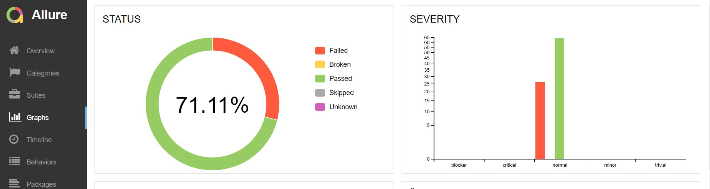

# Отчет о тестировании

## Краткое описание
В рамках поставленной задачи по тестированию сценариев покупки тура, была произведена автоматизация тестирования [запланированных](https://github.com/Darythefirst/Aqa.Diploma/blob/fb3fdc3f8b63f5f8c37eaf567d62029f6b5d9a02/docs/Plan.md) сценариев.

Произведено тестирование покупки тура посредством:
* Оплаты с помощью дебетовой карты
* Уникальной технологии: выдача кредита по данным банковской карты.

Произведена проверка подключения к БД: MySQL, PostrgeSQL

Оформлены баг-репорты: 14 шт.

## Количество тест-кейсов

Общее количество тест-кейсов: **90**, в т.ч.:
Тест-кейсы покупки тура по дебетовой карте: **45**
Тест-кейсы покупки тура в кредит: **45**

## Процент успешных и не успешных тест-кейсов

Количество успешных тест-кейсов: 64 (71% от общего числа)

Количество неуспешных тест-кейсов: 26 (29% от общего числа)

## Общие рекомендации
1. Разработать документацию к веб-сервису с учетом требований законодательства страны 
2. Устранить баги в соответствии с заведенными баг-репортами и повторить тестирование
